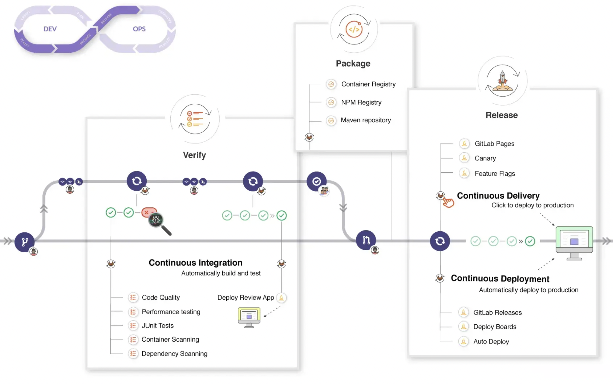

# CICD

看过很多文章的 `CICD`，都是摆上很多图很多概念，进行介绍，虽然这是必要的，大家需要理解流程，但是总感觉差点意思，比如说，下面这张完整 `CICD` 流程图

看这个图第一眼就是，what？！这啥。

关于 `CICD` 介绍的文章呢，很多，我这里只是做一下自我的概述，其实也就是大白话说下。

概念：

- CI，Continuous Integration，持续集成。
- CD，Continuous Deployment，持续部署。

`CICD` 一般合称，无需特意区分二者区别。

## 无 CICD

所谓的持续集成、部署，说大白话，就是当我们改了代码，要将新代码放到服务器上执行，可以是测试服务器，也可以是生产环境服务器，给测试或者用户使用。

如果没有 `CICD`，我们大致需要如下操作：

> 前端哦

1. 执行项目的打包命令，然后打包之后的代码做成压缩包。
2. 把包给后端或者运维同事，让他们帮助我们部署到丢到对应服务器上，然后访问。
3. 测试发现问题，你再改，改完在打包
4. 如此反反复复，从开发到上线，前端、后端、运维，都在捣鼓这个前端包，有问题就改。

这就特别繁琐，也很浪费效率，这就是没有 `CICD` 的情况。

## 有 CICD

有了 `CICD`，我们就不需要做这些事情了。一切都交给机器执行。
所以所谓的 `CICD` 就是 **自动化** 的工具，他可以帮助我们解放一些不必要的重复工作。

那么 `CICD` 是怎么做到的？

举个例子：
使用`Git`，平时我们都会使用代码仓库，目前主要都是 `Git`，在 `Git` 中的操作，都是有记录,并且可以在对应操作后进行回调的，比如说：

1. 提交代码 `push` 之后，做打包发布操作，在下文会有讲解如何监听。
2. `pull request` 的合并请求，合并前，进行代码静态检测，运行测试用例，合并之后进行重新部署等。
3. 像创建新分支。。。等等

有了这些功能，我们可以在 **特定的时间点**、**提交代码**、**合并代码** 或者 **合并分支** 等操作执行前后进行一些 **自动化** 的操作，解放自己。

比如说，我们更改了一段代码，`push` 到远程仓库，当仓库接收到之后，让它帮我们开一台虚拟机，帮助我们运行测试，检查代码格式，然后打包，放到对应的服务器的对应文件夹里面。

基本我们能想到的大部分命令行操作，都是可以帮我们做的。
